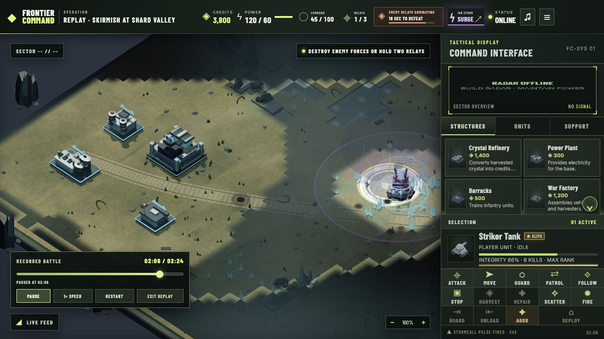
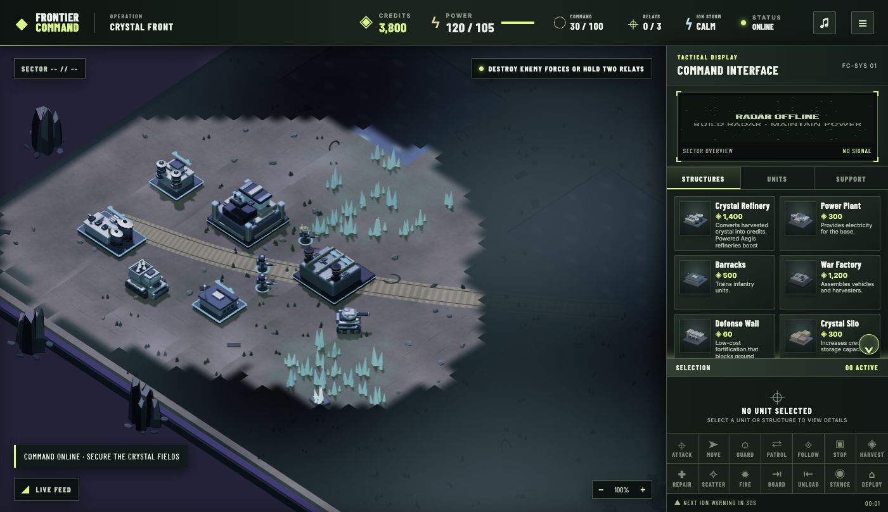
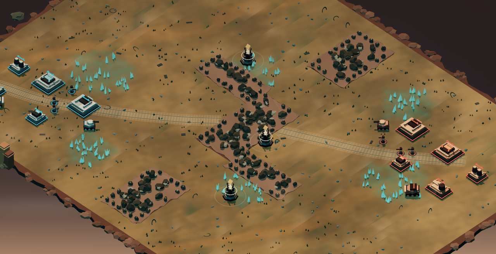
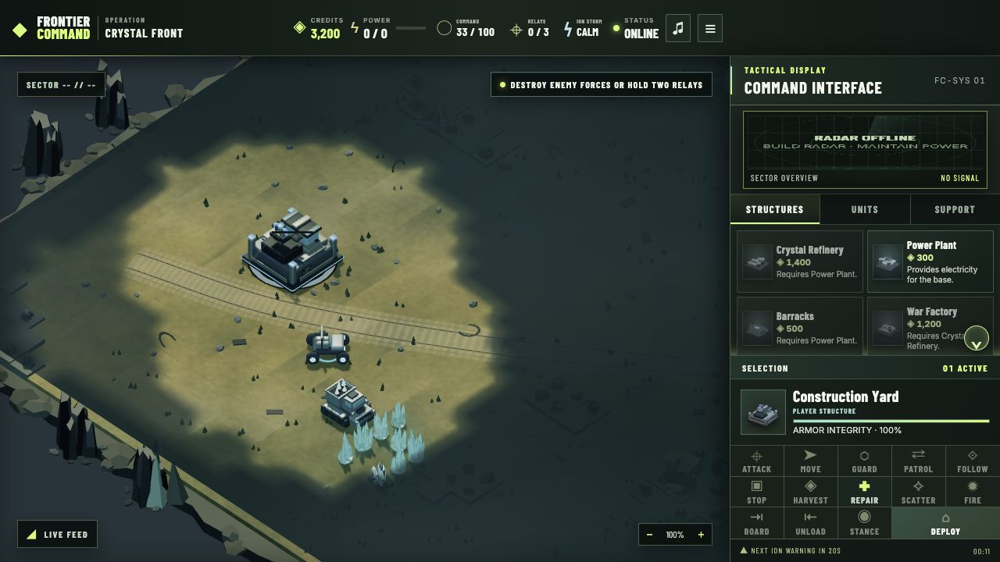
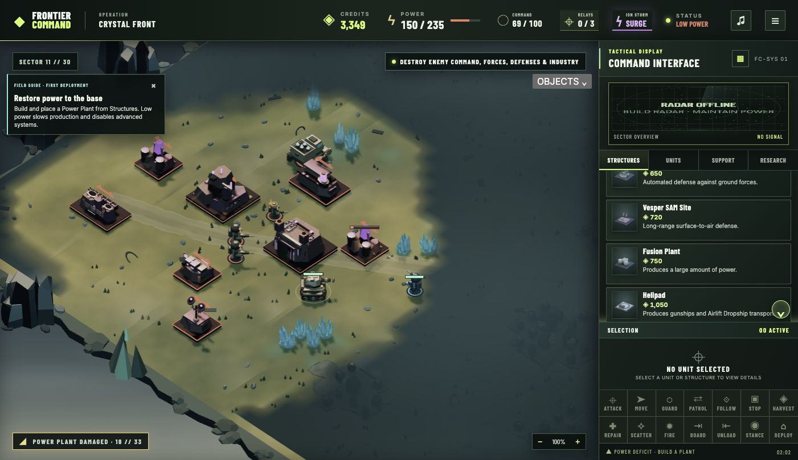
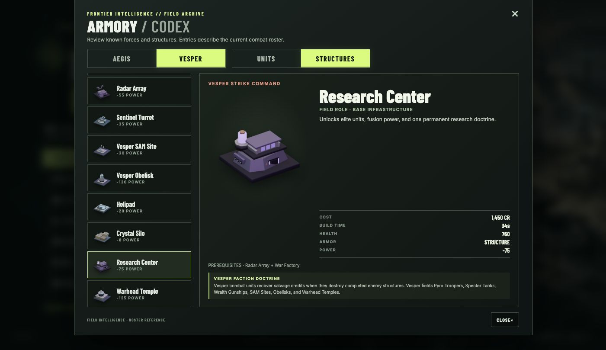
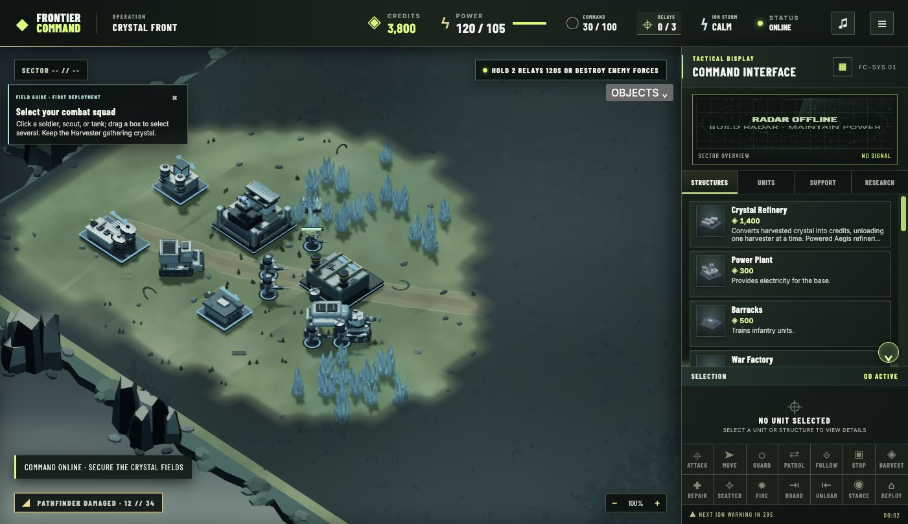
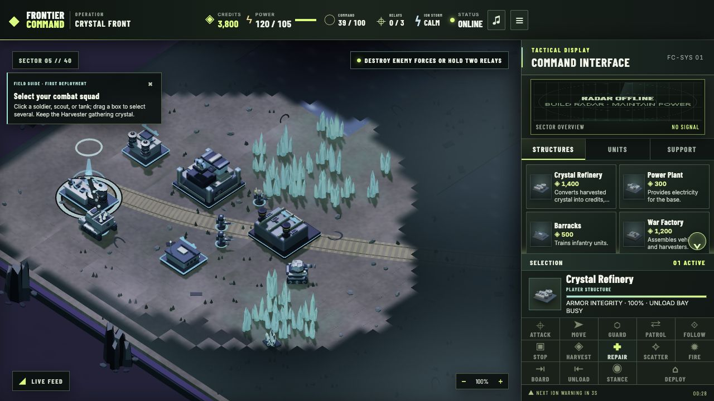
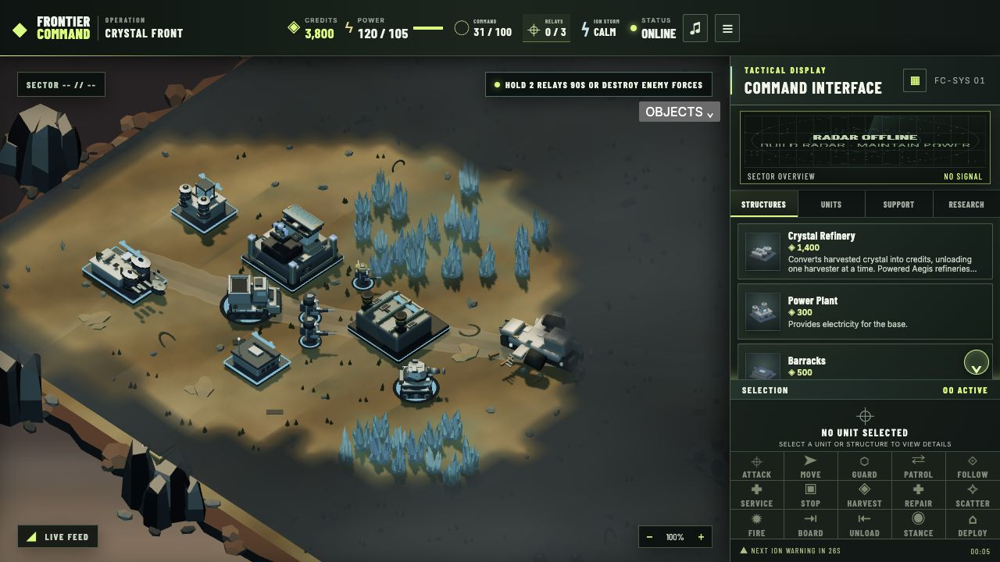
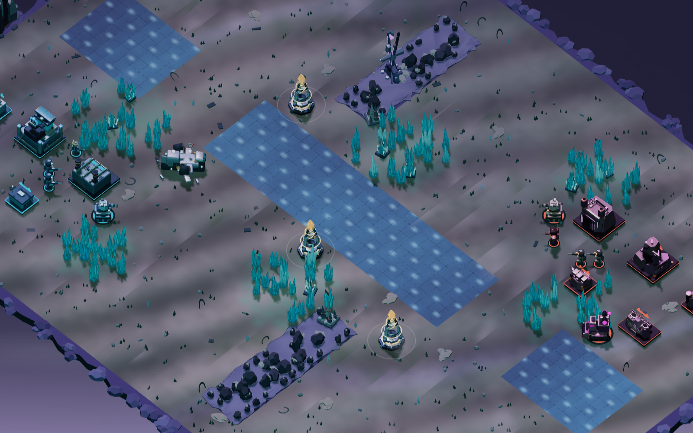

# Frontier Command

An original browser RTS about the Aegis Directorate and Vesper Collective. Build a crystal economy, expand a base, command ground and air forces, contest Resonance Relays, and adapt to moving ion storms. It includes skirmish play and 15 authored operations: twelve story missions, two selectable route missions after Black Shard, and a bonus airlift rescue. Their objectives cover economy, capture, defense, assassination, relay control, storm survival, resource racing, escort, fallback, and final assault.

The game takes broad inspiration from classic real-time strategy. Its factions, setting, art, rules, interface, and missions are original additions; this is not a full *Command & Conquer* recreation. [Research notes](docs/RESEARCH.md) separate the historical reference from what this project implements.

















## Run

```sh
npm install
npm run dev
```

Open the local URL printed by Vite. For a complete production deployment, run `npm run build` and `npm start`; this serves the built client and online server. `npm run preview` serves only the built client and is useful for local visual checks.

`npm run dev` keeps the Node records server running while Vite refreshes the client. Restart the dev command after changing server or shared game rules so both processes use the same replay version; the client labels new solo runs unranked when they differ.

Run the deterministic game, campaign, replay, and server checks with `npm test`.
Run the CPU-only five-map dense-battle diagnostic with `npm run stress`; it reports simulated contact, unit and effect peaks, update-time percentiles, and suspected movement stalls.
Run `node scripts/campaign-late-public-playtest.js` for public-command tactical probes of three later campaign operations on Normal and Hard.
Run `node scripts/campaign-first-harvest-playtest.js` for a reproducible public-command completion check of the opening operation on Normal.
Run `node scripts/relay-logistics-public-playtest.js` for a paired public-order relay and Harvester-delivery comparison.
Run `node scripts/iron-current-public-order-probe.js` for the v54/v55 passive-versus-directed freight-relay comparison.

## Play

The campaign selection screen groups its fifteen missions into four named chapters, including the route choice and postwar operation. An operations rail shows cleared missions and the current chapter while leaving optional routes replayable. Chapter dividers summarize the next stage of the valley conflict without changing mission unlocks.

Campaign unlocks, medals, branch choice, and completed Field Orders sync from the signed-in commander's verified victories at each difficulty. The selector also preserves local practice progress from this browser, labels its source, and makes ranked readiness clear before deployment. A Normal victory does not mark the same operation completed on Hard. The first read of an older local save copies its shared unlock counter into all three difficulty ledgers so previously available practice missions stay available. **Ashes in Transit**, **Ghost Channel**, and **After the Dawn** start with fixed forces; their in-battle command deck opens on Field Support and omits unusable construction, production, research, and base-only controls.

The operations rail sits over an original Shard Valley theater panorama in `public/assets/campaign-theater-panorama.webp`; progress labels and route markers remain live UI rather than baked into the art. The title uses stylized cinematic art derived from the game's own battlefield look, with restrained motion and a dark text-safe edge. Mission briefings pair readable live controls with five original cinematic scenes keyed to their objectives: crystal economy, signal infiltration, relay warfare, extraction, and the final airlift. Reduced-motion settings stop the title animation.

New solo operations open with a brief, skippable deployment arrival: the camera settles on the starting force while the operation name and objective appear over the field. The battle clock stays paused during the arrival, and any battlefield input starts command immediately. Reduced-motion settings skip the transition.

- Choose **Deploy Now** for a guided Cadet skirmish, or configure a faction and difficulty in Custom Skirmish. The setup atlas previews actual map terrain, crystal lanes, crossings, start positions, and relays before deployment; seeded deposit details may vary. Deploy Now includes a dismissible first-deployment guide that responds to selecting a squad, scouting, capturing relays, enemy Relay Dominion pressure, and storm opportunities; its instructions adapt to mouse and touch screens. Cadet skirmishes give you 45 seconds before the AI's initial neutral-relay rush, even if you claim one relay early. **Story Campaign** has twelve original story operations, a route fork after Black Shard, and a bonus operation after the finale. Complete either Ghost Channel’s fixed-force signal heist or Iron Current’s freight-reserve defense to reach Red Ledger; the other route stays replayable. Existing saves that had reached Red Ledger retain access. Each operation opens a briefing with its objective, selectable campaign doctrine, and two optional Field Orders. Field Orders add a side objective and a clear bonus reward; marked targets appear as a subtle gold beacon on the battlefield. Choose **Primary objective only** to skip the contract. Your valid Field Order preference is remembered per browser and can be changed for each sortie. This browser’s campaign ledger tracks completed Field Orders per mission and difficulty, up to 30, and marks earned contracts in the briefing while allowing replay. Campaign doctrines are **Standard** (normal unit attributes), **Rapid** (player units move 12% faster), **Reinforced** (player units have 12% more maximum health), or **Precision** (player unit weapons deal 10% more damage). Doctrine choice is available on every sortie, including fixed-force missions, and is saved as your browser's briefing preference. It affects player campaign units only. Live objective and Field Order trackers show mission-specific progress, while the first operation also offers dismissible tips tied to the construction, power, and economy state. After an operation, its debrief shows measured stats, medal criteria, and Field Order outcome, then previews the next briefing. The arc includes **The Silent Switch**, an engineer escort to capture a hardened radar array, **Ashes in Transit**, which asks the analyst to transmit codes at either marked uplink before extraction, plus Black Shard’s relay-shield breach, storm survival, sustained relay control, a timed assassination in which the signal chief flees toward extraction once spotted, a fallback defense, and **Dawn of the Free**, a two-stage finale that holds both relays to break the enemy command shield before the final assault. **After the Dawn** unlocks afterward: airlift a fixed rescue team across a flooded channel, hold a relay with the engineer present, and extract the engineer before the deadline. Fixed-force escort and rescue missions have a tactical minimap uplink that marks their current objective without revealing hidden enemies. Quiet Knife marks the southeast enemy extraction zone on that uplink as soon as the chief is spotted. Campaign missions offer easy, normal, and hard difficulty; best medals are tracked separately for each.
- In **Last Light**, keep the command yard alive until the evacuation timer expires, or counterattack the eastern flank force once it deploys. The live tracker shows its arrival countdown and remaining units; archived replays retain the original timer-only condition.
- On **Hard**, After the Dawn warns of a Vesper reserve patrol five seconds before it reaches the east-bank team after the relay hold. Board the engineer promptly and choose whether the remaining troops fight or cover the extraction.
- The first route completed at a difficulty changes **Red Ledger** itself. Ghost Channel grants a 20-second opening trace of the payroll courier and its nearby escort; new sorties must intercept the courier as well as fund the second powered refinery and 4,800-credit reserve. Iron Current supplies an Engineer and a 700-credit freight cache at the eastern crossing; new sorties must recover that cache with the Engineer alongside the same economy goal. The briefing and live objective tracker show the active required task. Ranked runs derive the route from the first verified branch victory on that commander profile; older saves and replays retain their original completion rules.
- **Carryover Intel** makes a completed Field Order matter in the next operation. The first order unlocks **Assault Intel**, which shields starting armed units for 45 seconds; the second unlocks **Signal Intel**, which adds 50 starting command energy. The preceding operation and difficulty must match. Browser-earned choices work for local play; ranked sorties require the same profile's verified completed Field Order. The briefing shows which choices are ranked ready, and its Deploy button stays visible while you review a long briefing.
- **Survivor Attachment** carries one living armed unit from the latest preceding victory into the next campaign operation. The unit keeps its original faction equipment, Veteran or Elite rank, and any Elite field modification; a rookie who survives earns Veteran rank for the next deployment. Its arrival tile is chosen deterministically beside the authored opening force. The debrief names the survivor, and the next briefing shows whether it is verified for ranked deployment or available only for local practice. The server derives ranked attachments from its own replay result and locks them into the next run ticket. A newer victory with no eligible survivor clears the attachment. Earlier campaign victories do not gain a retroactive survivor.
- **Route Requisition** adds a bounded campaign plan across sorties. Each distinct completed Field Order along the earlier route earns one token at that difficulty, with at most three available. A victorious operation using a package spends one token once; a loss preserves it. At the briefing choose **Forward Reserves** (+500 credits and storage), **Reconnaissance Sweep** (a 20-second objective-area scan), or **Vanguard Refit** (+10% maximum health for starting armed units), or save the token. Offline play uses the local earned ledger; ranked tickets check the profile's verified order and spending history. The package is locked into the replay, save, personal history, and leaderboard filter. The opening mission cannot use requisition.
- **Three Points of Light** now turns the first secure relay pair into a tactical choice: western plus central calls a yard guard, central plus eastern brings armor to the far side, and western plus eastern sends a fast crossing screen. The reserve arrives once, stays with the battle through saves, and is shown in the live objective. Version 23 and older replays keep the original mission rules.
- Pick Shard Valley, Twin Passes, Delta Crossing, Canyon Ring, or Storm Basin in skirmish setup. Each battlefield has seeded crystal deposits, a distinct terrain route, and its own lighting and ground palette. Twin Passes and Canyon Ring also have two seed-selected route variants that shift their crossings, contested fields, and relays; the chosen variant persists in saves and replays. Version 44 moves Canyon Ring variant 1's breaches. In the measured start-tank route to the middle relay, the player path fell from 43.3 to 24.1 tiles; the enemy route measures 15.3 tiles. Version 43 replays retain the earlier breach layout. The first **Deploy Now** launch starts a guided Cadet match on Shard Valley; later launches rotate among the five maps using the run seed. Restarting or loading a local save keeps its selected map. **Delta Crossing** opens with a Dropship and two extra rifle squads on each side. Its two armored bridges can be destroyed to force a ground detour, then rebuilt by an engineer from the bank. Ground units caught on a collapsing span are lost; aircraft can cross safely. Select an armed unit and right-click a visible bridge to demolish it; select an engineer and right-click a destroyed span to repair it. On touch, select the unit and use **Attack** or **Repair** to target the bridge. Veteran and Elite AI may demolish a visible span to deny an approaching armed force and can reopen the crossing with an engineer if both spans are down. Bridge state is included in saves and complete battle replays.
- Custom Skirmish offers two **Opening Force** choices. **Forward Base** begins with industry and units online for immediate combat. **Command Rig** gives each side a Mobile Command Rig, Harvester, Buggy, and 3,200 credits, with no starting buildings. Select the rig and press `E` or **Deploy** to establish a Construction Yard, then build power, a Refinery, and production. The AI deploys its rig and builds from the same starting economy. In version 25 skirmishes, the AI can divert a nearby assault unit to answer a close visible threat to key base assets, then restore that unit's saved assault order after the threat leaves. Skirmish also offers two victory conditions: **Relay Dominion** rewards a continuous majority hold, while **Elimination** keeps relay energy and shelter but requires destroying the opposing combat and rebuilding force, command, and active industry. Powered defensive weapons must also be neutralized. Passive infrastructure such as power and radar, and unpowered defenses, cannot prolong a lost Elimination match. In solo Elimination, the Objects finder and powered minimap mark unconfirmed last-seen hostile combat or recovery units at their last observed sectors; scout a sector to clear its stale marker. The opening and victory choice survive saves, replays, restarts, and ranked run verification; leaderboard skirmish results are separated by both. Guided **Deploy Now** uses Forward Base and Relay Dominion.
- Selecting a skirmish battlefield reveals a short tactical briefing before deployment. Delta Crossing gives separate opening advice for its Forward Base air insertion and Command Rig bridge-control starts.
- Current skirmish battles draw one of three seed-locked enemy commanders. **Raider** fields early Buggies and commits more units to visible Harvester raids; **Relay Marshal** commits a larger ground reserve to contest relays; **Siege Director** favors guarded forward expansion and escorts artillery against defenses it can see. The deployment briefing and battle HUD name the rival strategy. Opponent Skill still sets Cadet, Veteran, or Elite independently. The strategy survives saves and replays, while older recordings retain their original AI rules. Commander Records shows and filters the rival strategy; a debrief benchmark compares victories against the same commander.
- In version 56, skirmish AI Harvesters under a visible nearby ground threat turn back toward a functioning refinery, bank any cargo, then resume harvesting. Hidden units do not trigger this response. Earlier replays keep their former Harvester behavior.
- Secure Resonance Relays offer three protocols. **Shelter** protects nearby forces during ion surges, **Overdrive** boosts local ground reload and command energy, and **Logistics** adds 10% of accepted Harvester cargo at refinery unload per secure relay (up to 30%, capped by storage). Logistics earns no credits without a delivery or while contested. Each switch locks for 12 seconds; replays through version 48 retain their original two-protocol rules. A paired public-order Shard Valley opener captured the same relay at tick 632 under both choices. Its first two deliveries yielded 700 + 700 credits under Shelter and 770 + 770 under Logistics, a 140-credit difference at 71.4 simulated seconds. This is a controlled route, not a broad balance assessment.
- In skirmish and multiplayer, each ion-storm surge can open a **Stormglass Bloom**: a public cyan crystal patch near the storm, enriched for 90 seconds. Crystal gathered inside it marks Harvester cargo as charged; accepted charged cargo earns 35% extra on delivery, within remaining credit capacity. The battlefield marker and storm locator show where the opportunity is and how long it remains. During an active Bloom, select at least one Harvester with one armed ground escort per Harvester; the Harvest button becomes **Bloom** and `Shift+H` issues the same expedition order. It chooses reachable charged crystal, keeps escorts with the Harvesters, and returns loaded cargo when the opportunity closes. `H` still issues ordinary Harvest, and direct orders override the expedition. A skirmish opponent may send a Harvester and escort when the route is reachable, stocked, and safe enough to justify the detour. Campaign storms retain their earlier rules.
- Left click selects a unit or structure. Drag with the left mouse button to select units. Right click orders selected units to move, attack, harvest at a crystal field, or sets a rally point for a selected Barracks or Factory. WASD, arrow keys, the visible camera pad, or middle mouse drag pan the view; the wheel zooms. Multi-unit Move, Force Move, and Attack Move orders assign separate reachable destinations that preserve the squad's relative layout. Use Attack Move to fight through a destination, Force Move to travel without engaging, Guard to defend an anchor, Patrol to loop between two points, Follow to escort a friendly unit or structure, Force Fire to attack a ground position, and Scatter to spread a selected squad away from local threats. Cycle combat stances with `T` or the command bar: **Aggressive** pursues freely, **Defensive** fights nearby threats but limits pursuit, and **Hold Fire** waits for an explicit Attack or Force Fire order. Force Move is also available with `Alt` plus battlefield click; Force Fire uses `Ctrl` plus battlefield click. Selected units show their orders and destination markers on the battlefield. The live-feed badge warns when your forces are damaged and can center the camera on the affected sector; a missing Command Yard or Harvester also raises an alert. Tab can focus the battlefield for match hotkeys; Space and Enter activate focused HUD buttons without issuing battlefield commands.
- The desktop Build deck opens in a readable list with names, prices, and descriptions. Its header toggle switches to a compact grid and remembers the choice in this browser. The separate **i** control on a unit or structure card opens its blueprint details, including prerequisites and current availability, without ordering production. On desktop, four squad slots sit between selection details and unit commands; select units, press + to assign a slot, and press its number to recall survivors. On narrow screens, the same strip starts compact with four direct recall buttons; expand it to assign selections without losing access to the battlefield. Number-key control groups continue to work.
- Press `O` or use **Objects** above the battlefield for a keyboard accessible list of your units and structures, currently visible enemies, and visible wrecks. Browse with the arrow keys, choose with Enter, and close with Escape. Friendly entries select and center the camera; enemy entries center it without issuing an order. Each entry gives health or salvage and a sector coordinate; wrecks also show the seconds before they disappear, so an Engineer recovery can be weighed against travel time. See the [live object-list check](docs/screenshots/object-picker-live-2026-10-04.png).
- Train an **Armored Carrier** at a War Factory to transport three infantry on the ground, or an **Airlift Dropship** at a powered Helipad to carry four across water and cliffs. Select infantry and right click a friendly carrier, or press `L` and target one, to board. Select a loaded carrier and press `U`, then choose clear ground for deployment. Passengers are sheltered from direct combat while aboard; a destroyed carrier ejects survivors onto nearby ground with damage when space is available.
- Build a **Field Workshop** after a War Factory to keep an armored push in the fight. While powered, it repairs nearby friendly ground vehicles for credits; infantry, aircraft, and embarked passengers are not serviced. Multiple workshops do not stack repair speed on the same vehicle. Select damaged ground vehicles and use **Service** in the command deck, then target a friendly Workshop, or right-click the Workshop directly. Vehicles travel to a reachable repair approach, wait through power or credit shortages, and resume their previous orders once fully repaired.
- Ground vehicle losses can leave a **recoverable wreck** for 120 simulation seconds. A selected Engineer can right click a visible wreck, or use the **Engineer** command on touch, to secure its credits after reaching it and working for four seconds. Either side can claim it, storage capacity still applies, and the wreck does not block routes. Infantry, aircraft, and carriers do not leave recoverable wrecks. The mechanic is saved, replayed, and supported in live matches.
- Build a powered **Research Center** to unlock an initial field focus from the **Research** tab. Spend 900 credits and 48 simulation seconds on **Logistics Network** (+25% crystal gathering), **Siege Protocol** (+20% damage to structures), or **Signal Lattice** (+25% command energy regeneration and 20% faster ability cooldown recovery). After that doctrine finishes, choose one 700-credit **Tactical Package** over 38 simulation seconds. **Breach Window** marks a visible target zone for 12 seconds, increasing friendly ground fire against structures inside it by 45%; **Interdiction Pulse** briefly suppresses visible enemy mobile weapons in a small area; **Rally Signal** heals armed ground units, clears their suppression, and orders them toward the chosen point. The unlocked action appears first in **Support** with its own energy cost and cooldown; the two unchosen package actions stay out of the battle deck. Both research stages pause while the center is unpowered or destroyed. The AI chooses and uses a package from the visible battlefield situation; research and casts are included in saves, complete battle replays, and live multiplayer.
- In skirmish and live 1v1, a commander can spend 1,350 credits and 60 powered research seconds to replace the initial doctrine once. The old effect remains active until the new focus completes; the chosen Tactical Package remains available. Campaign research stays permanent.
- A secure captured Resonance Relay can switch between **Shelter** and **Overdrive** in the Support tab; the header's RELAYS control opens those settings directly. Shelter protects nearby friendly units from an ion surge. An Aegis Shelter relay also restores nearby friendly infantry at 1 HP per second while secure, making it a forward triage point. Overdrive gives exactly 0.45 extra command energy per second and lets friendly ground units within 2.3 tiles reload 15% faster while the relay stays secure and uncontested, but disables that relay's shelter and recovery. Contention immediately removes the reload benefit. Multiple relays do not stack this benefit; it can combine once with Overcharge. A switch locks the relay for 12 simulation seconds, so storm timing and garrison position matter. Solo skirmish AI also uses the choice; saved battles, versioned replays, and live private matches retain it. Overdriven relays show an amber corona above their faction-colored core.
- Build inexpensive **Defense Walls** around vulnerable approaches. They block ground movement and reduce direct ballistic or cannon damage to friendly ground units immediately behind an intact wall by 28%. Flanking and area attacks bypass this cover. Walls can be damaged, repaired, or sold like other structures, but cannot keep a defeated base alive by themselves.
- Use the Structures and Units tabs to build and train. Place completed structures near your base. Cancel a queued unit with its visible cancel button, or right click its production card. Select a Mobile Command Rig and press `E` to deploy a new Construction Yard.
- Select a loaded Crystal Harvester and press `J` or **Return** to bank a partial load early. Each Refinery unloads one Harvester at a time, so a second Refinery can clear a traffic bottleneck. The selection card shows cargo and whether the Harvester is returning, waiting for a bay, or unloading.
- The opening Power Plant produces 120 power. Contest relays by keeping ground units nearby: owned relays increase command energy, reveal nearby terrain, and uncontested friendly relays shelter nearby units from ion-storm damage. In Relay Dominion skirmishes and multiplayer, holding two uncontested relays for 90 continuous game seconds wins; Cadet skirmishes allow 120 seconds to answer a relay majority. Losing the majority resets the timer. Elimination skirmishes have no relay victory timer, leaving room to build research, elite units, and a larger assault. The skirmish AI sends a bounded squad to break a player countdown, keeps a small relay garrison when it can, divides its base defenders among simultaneous visible attack lanes, and chooses exposed assault targets using both strategic value and travel distance. Once Aegis has Radar, it can train one Field Medic for wounded infantry and keep that medic with a supporting squad rather than send it in an assault wave. Cadet waits briefly before contesting neutral relays; Veteran and Elite make a limited ground-carrier flank on other maps and launch an opening Dropship insertion on Delta Crossing. Storm surges can enrich crystal and expose unsheltered units to damage.
- In current skirmish rules, the opponent may use Tactical Scan on a recent last-seen position when an armed squad can follow up. It spends at most one command ability per AI decision tick, prioritizes Shield Pulse for wounded troops in contact, and keeps energy in reserve before boosting production. After completing its initial doctrine, it can make one costly adaptation when visible battlefield conditions clearly favor another focus. Archived solo replays keep the AI policy from their recorded rules version.
- When a visible player-held relay starts a Dominion countdown, the skirmish AI can recall a committed squad and, under version 39 rules, prioritize one nearby eligible responder for a direct move into capture range. Version 40 also sends one available fighter to scout a reachable public relay site when every player-held relay is outside enemy sight; the direct counterattack still requires live sight. The scout keeps its previous order through saves and restores it when the countdown ends. It does not choose sites from hidden ownership. Under version 41, an urgent responder that already saw a player relay may continue toward that last observed public location for up to ten seconds after sight drops, while the public countdown persists; higher-priority duties or a visible ownership change cancel it. Base defense and specialized tasks retain priority. Under version 41, the skirmish AI can rebuild after a raid destroys its last refinery: if its command yard and power survive, a safe site exists, and up to two surplus defenses can fund construction, it sells only the needed defenses and restarts idle loaded harvesters when the replacement opens. Older replays retain their original economy behavior.
- At 75 simulation seconds in skirmish or live multiplayer, a public salvage drop is announced 12 seconds before it lands. Its beacon and minimap marker are visible even without radar; click the battlefield locator to center on it. Hold the site uncontested with any armed ground unit for five seconds before the cache expires to earn up to 450 credits within storage and 20 command energy. Enemy forces can contest or claim it too. The solo AI may send one available unit, but base defense and Relay Dominion take priority. The drop is absent from campaign and older replay rules.
- A revealed neutral relay gains a sector locator above the battlefield. Click it to center the actual capture spire; unseen relay ownership stays hidden. In longer Veteran and Elite skirmishes, the AI can save for one Mobile Command Rig outpost near a reachable, unserved crystal field, establish a local Refinery, and support a third Harvester. Autonomous skirmish and multiplayer Harvesters use separate reachable refinery approaches so a narrow corridor does not permanently stop their economy.
- Relay intel follows live sight. Outside it, the Support cards hide non-owned control, protocol, contest, and switch timing until a unit scouts the site or Tactical Scan reveals it. A powered minimap marks explored but currently unseen relays as unknown; friendly forces and relays use squares, visible hostile contacts use diamonds, and neutral or unknown relays use circles so color is not the only cue.
- The two factions have distinct field doctrines. **Aegis** harvesters extract 20% faster from crystal within six tiles of one of their powered refineries, rewarding forward infrastructure and its defense. **Vesper** combat units recover 12% of a completed enemy structure's cost, up to 180 credits, when their weapon deals the lethal hit; the reward respects storage capacity. A concealed Vesper Specter Tank also suppresses the weapon of the mobile ground unit it directly hits for two seconds on its first ambush shot; nearby splash targets are unaffected. The production cards and selection panel explain the field states.
- Faction armor now has a timed field action in the selection rail (`E` with one tank selected). An **Aegis Guardian** can Brace for seven seconds, anchoring itself and reducing direct damage to nearby friendly light and heavy vehicles by 25%; area damage bypasses the field. A **Vesper Specter** can Ghost Run along an existing move order for six seconds at 1.65× speed while unable to fire. Each action has a 30-second cooldown, a visible active/cooldown state, and a battlefield effect. The solo AI activates either action when the visible fight warrants it. These orders persist through saves, version 36 replays, and live multiplayer.
- Combat units earn experience from effective enemy damage and kills. Rookie, Veteran, and Elite ranks grant up to 10% extra damage and maximum health. At Elite, each armed ground unit can choose a permanent field modification: Bulwark takes 15% less incoming damage after armor and cover, while Rangefinder gains one tile of weapon reach. Select an eligible unit and choose its modification from the selection card; solo play pauses while you decide, and live multiplayer continues. The choice, rank, kills, and experience persist through saved battles and current-version replays.
- Armed light and heavy ground vehicles have directional armor: attacks from a 60° front arc deal 15% less damage, attacks from a 60° rear arc deal 20% more, and side hits are unchanged. This applies to each splash victim from the projectile's launch direction, so turning a tank toward fire and attacking its rear are deliberate tactical choices. A selected vehicle shows a cyan front and amber rear arc on the ground; this [live Striker capture](docs/screenshots/directional-armor-live-2026-10-04.png) shows the guide. The rule is deterministic in saves and version 12 and newer replays; older replays retain their historical damage.
- In **Support**, choose Tactical Scan, Overcharge, Shield Pulse, or **Relay Stormcall**, then click a target area on the battlefield. Stormcall costs 55 command energy and can be aimed at visible ground within six tiles of a secure friendly relay during a storm warning or surge. It draws the moving ion storm toward that point for up to 35 seconds. If the surge reaches the target while that relay stays secure, it discharges one ion pulse against enemy units within 3.2 tiles. An enemy entering the relay's capture radius cancels the pending pulse, so scouting and holding the anchor matter. Troops near an uncontested friendly relay are sheltered from ordinary storm damage, while exposed troops on either side remain at risk. The systems line shows whether the pulse is armed or fired and counts down to the next weather phase. Command energy recharges over time and faster while you hold relays. The same tab also contains strategic strikes, structure sale, center base, the Field Manual, and the **Armory / Codex**. The Armory is also on the title screen; it lists both factions' units and structures with model portraits, costs, production sites, prerequisites, and field roles. Opening it during a solo battle pauses that battle until it closes; live multiplayer continues.
- `WASD` or arrow keys pan in all four directions; `Q` remains a left-pan alias. `Shift+A` attack move, `M` force move, `G` guard, `P` patrol, `F` follow, `L` board, `U` unload, `V` force fire, `X` scatter, `T` cycle combat stance, `Shift+S` stop, `H` harvest, `Shift+H` escorted Stormglass Bloom expedition, `J` return Harvester cargo, `E` deploy an MCV, `R` repair a selected structure or target an Engineer task, `N` cycle owned units, `B` open Structures, `Space` center on your base, `Ctrl+1…9` assign groups, `1…9` recall groups. `Escape` cancels an active command or pauses.
- Select units and press **ROUTE** beside the battlefield controls to plan with successive taps or clicks: empty ground adds a waypoint, a visible enemy adds an attack, and the **ATTACK** or **MOVE** buttons let you add Attack Move or Force Move destinations. Press ROUTE again or Escape to finish. Mouse users can also hold **Shift while right-clicking** to queue up to eight waypoints or visible enemy attacks, or hold Shift while placing an Attack Move target or Alt-click Force Move target. The selected squad leader shows the planned route; a regular order cancels its remaining queue. Queue commands work in solo replays and online matches from version 56 onward.
- On narrow screens, the battlefield, scrollable production deck, selected-unit details, and command buttons share one screen. On phones at least 720 px tall, the command rail uses four columns and four rows; at 390 × 844 px, its buttons measured about 98 × 48 px. Shorter portrait phones use a compact three-row rail to preserve battlefield space. The fixed bottom bar includes Force Move and the other unit orders; **Radar** opens the minimap over the battlefield when needed. The mobile command deck can collapse to a 44 px peek row to give the battlefield more space; the offline radar card clearly says when the Radar Array or power is missing. Touch input taps to select, drags immediately to pan, and holds briefly before dragging to box-select a squad; use command buttons and the zoom controls for navigation and orders. Four touch squad slots sit above the bottom bar: tap **SQUADS** to expand assignment controls, tap **+** beside a number to assign selected units, and use the always-visible number buttons to recall survivors. A highlighted slot matches the current selection. Keyboard groups 1–9 remain available.
- Three manual save slots are stored in this browser's local storage. The pause menu opens a slot picker showing the operation, difficulty, elapsed time, and save date; occupied slots require confirmation before overwrite or deletion. **Continue Saved Game** opens the same picker from the title screen. An existing single save is migrated into slot 1. Campaign saves preserve the doctrine, Field Order, Carryover Intel, and Survivor Attachment chosen for that sortie, and replay playback restarts with those same choices. Older saves and replay records without a doctrine use **Standard**; missing Field Order and Carryover Intel fields default to **none**. The briefing preferences are stored separately in this browser and reused when valid for another sortie.
- An active solo battle also writes one temporary checkpoint in the current tab about every 20 seconds and when the page is hidden or reloaded. After an interruption, the title screen offers **Recover … · Unranked**. Recovery keeps the manual slots intact and resumes the battlefield as an unranked game; it does not continue the previous leaderboard ticket or complete battle replay. Starting a new battle, intentionally returning to the title, or finishing the battle clears that checkpoint.
- Solo battles advance the rules in fixed 1/30-second simulation steps while rendering remains frame driven. Online runs record successful player commands at those tick boundaries for server replay verification. Local saves retain the completed tick and remain playable, but loading a save starts an unranked session. Existing saves remain loadable.
- After a complete solo battle, choose **Watch Battle Replay** in the debrief or **Watch Last Battle** on the title screen. The replay re-simulates your recorded orders locally with pause, restart, and 1×–8× speed controls. Drag or use the keyboard on the replay timeline to seek to a moment; long seeks advance in bounded batches so the interface stays responsive. Current recordings also save up to eight key moments, such as relay captures, research completion, command abilities, and campaign intelligence. Select one to jump shortly before it happened. These markers are local viewing aids and do not change the verified command replay. Loading a mid-battle save does not create a complete replay.
- **Commander Records** shows **My Battles**, a private server-backed history of the 30 newest verified solo victories and defeats for the signed-in commander. It also keeps a local archive of up to ten completed solo replays on this device. Local records show the map or operation, victory or defeat, battle time, orders, and kills; successful campaign records also show stars. Each has a Watch and Delete control. Older single-replay records are migrated when available and remain viewable without an inferred result; deleting an archived replay keeps it deleted. The public victory leaderboard, private online history, and local replay archive are separate.

## Online play

The **Multiplayer** menu connects to the companion Node server. Profiles and friend lists use a persistent eight-character friend code; add a commander by code, accept requests, then invite an online friend to a private room or share its six-character room code (the join link uses `/?join=CODE`). Rooms support two commanders. Friend invitations are available while a room has an open seat; the server acknowledges accepted invites and rejects them once the friend is offline or the room is full or playing. The host chooses Aegis or Vesper; the guest is assigned the opposing faction. In the lobby, the host selects one of five battlefields and either Relay Dominion or Elimination; changing either choice clears both ready checks. Both players mark ready, then the host starts the match. Follow, Force Fire, Force Move, and Relay Stormcall are supported in live matches; the server validates and applies these orders to the authoritative game state. Each multiplayer order carries a request ID, so success feedback waits for the matching server acknowledgment. Rejected orders and lost confirmations show an error, including keyboard orders. A lost confirmation disarms target, placement, or ability mode because the server may already have applied the command; inspect the battlefield before manually retrying. An explicit server rejection leaves targeting available for a corrected order. The game runs on the server and sends each player a fog-limited view with opponent resource, construction, cooldown, production-queue, and unseen relay-control details redacted. Unseen terrain and crystal amounts are masked, explored tiles retain last-seen values, and map-generation state is withheld; a brief disconnect can reconnect to the same seat without clearing local camera, command groups, or selected production tab. The remaining commander sees an opponent-reconnecting status until the peer returns. Both rosters update when the commander returns, and a live two-browser reload check verified a post-reconnect order. If a match ends while one commander is offline, reconnecting reports the seat-specific win or loss for five minutes. Active matches checkpoint to the server store every five seconds and after successful commands, disconnects, and terminal results. After a short server restart, each commander can reconnect with the same profile to resume the authenticated seat; up to five seconds of simulation progress may roll back to the last checkpoint. Recent terminal outcomes also survive a restart for five minutes. Leaving an active match counts as a forfeit. Incoming invitations remain unobtrusive during a match, and the server rejects attempts to create or join another room while the current match is live. Players cannot manually save or resume a finished multiplayer match.

**Public 1v1 matchmaking** offers separate Casual and Ranked queues alongside private rooms. Casual pairs in FIFO order. Ranked starts with a mutual ±100 rating-point range, widens by 100 every 10 seconds, and becomes unrestricted after 120 seconds, preferring the closest eligible opponent. The search status shows the current server-reported range. Both queues assign a random battlefield and Relay Dominion, then wait for both ready checks and the host's launch. Either player can cancel search, and an unfilled entry times out. Casual and private matches never change a rating. Ranked search unlocks only when the connected server confirms the current ranked season and standings; an older server leaves the choice visibly unavailable.

**Commander Records** shows the signed-in profile's completed private, Casual, and Ranked 1v1 matches. Each result names the opponent, battlefield, victory rule, duration, and finish reason; ranked results also show the rating change. The server writes both commanders' outcomes before announcing the match end, retains them across restarts, and offers older results through **Load More Matches**. A separate season leaderboard lists the leading ranked commanders. Ranked 1v1 uses server-authoritative match outcomes, while solo scores use replay verification; the two rankings are independent. A forfeit or final disconnect can count as a ranked loss.

Targeted multiplayer orders, command abilities, and building placement keep their targeting mode open while the server confirms the order. Duplicate clicks are ignored during that wait. An explicit server rejection leaves the target available for a corrected order; an accepted order closes it and plays the success cue. A connection failure or lost confirmation disarms targeting because the server may already have applied the order; inspect the battlefield before retrying.

When a friend is offline, their roster row offers **Copy Link** while the room has an open seat. Send that room URL through your own channel; the normal join link opens the lobby when they return. Online friends still receive the direct in-game invite.
If another tab claims the same commander seat, the previous tab shows the room code and a clear Join Room path to take control back. After a completed match, the result screen offers **Add Opponent** using that opponent’s seat-specific friend code; duplicate and existing requests are reported in place. The code is kept out of public match history.

After a completed Casual or private match, either commander can offer a **Rematch** from the result screen. The other commander can accept or decline within one minute. Acceptance creates a fresh private lobby with the same battlefield and victory rule; both players start unready and choose when to launch. Ranked opponents return to the ranked queue instead. Rematch requests require both previous participants to be signed in and available, and expire if a seat is taken or the offer times out.

A two-browser live check created and accepted a friend request, joined a private room, completed both ready checks, launched the match, and issued move orders from both Aegis and Vesper. A later isolated match also verified both tanks reaching their ordered sectors and a Vesper Defense Wall progressing from production to placement in the authoritative world. Both fog-limited perspectives were checked in the isolated match.

Online skirmish and campaign victories can be submitted to **Commander Records**, with their mission or map shown beside each result. Skirmish rows identify Forward Base or Command Rig, Relay Dominion or Elimination, and the enemy commander profile, with filters for these different setups. Campaign rows also show the run's doctrine, Carryover Intel, deployed Survivor Attachment, Field Order outcome, and Red Ledger or Ashes route payoff. Filters let you compare records by mode, scenario, difficulty, opening, victory condition, enemy commander, doctrine, Carryover Intel, Survivor rank, Field Order, and route payoff. The server checks campaign mission availability against that commander's verified victories at the selected difficulty before issuing a ranked ticket; local browser medals still allow offline practice. It locks the selected setup and earned campaign advantages into each run ticket, then replays recorded orders from that ticket and derives victory, completion time, and kills from its own simulation. Only successful replay verifications rank. Simulated completion time determines points; the server checks it against run wall time. The Overdrive combat rule changed both solo modes in version 26. Version 27 improves skirmish AI use of command abilities, and version 28 makes its one-time research doctrine respond to the visible strategic situation. Version 29 adds Elite field modifications to both solo modes. Version 30 adds verified campaign Survivor Attachments. Version 31 adds the second tactical research tier and targetable package actions. Version 32 changes skirmish AI package decisions. Version 33 makes Dawnfall a relay breach followed by a command-yard siege and makes skirmish AI research suit the front it can reach. Version 34 sends Quiet Knife’s signal chief toward southeast extraction after discovery. Version 35 makes Black Shard a central-relay breach followed by an attack on the exposed forward array. Version 36 adds the Guardian Brace and Specter Ghost Run field actions and bounded AI use. Version 37 improves skirmish AI relay response under a player Dominion countdown. Version 38 adds the public skirmish salvage drop. Version 39 gives the skirmish AI one urgent, sight-limited Relay Dominion counterattack that prioritizes entering capture range of a player-held relay, and adds countdown signals to secure visible relays. When enemy control is hidden, the relay locator can cycle public sites for reconnaissance without revealing ownership. Version 40 lets the skirmish AI send one available fighter to scout a reachable public relay site when a player Dominion countdown is active but no player relay is in enemy sight; it chooses without hidden ownership information. Version 41 adds bounded AI refinery recovery after a raid and a short last-seen continuation for an urgent relay response. Version 42 adds one costly doctrine adaptation in skirmish and a Last Light flank-repel victory route. Version 43 makes skirmish AI hold a recently observed relay target through a brief loss of sight and turns Ashes in Transit into an uplink transmission followed by extraction. Version 44 changes Canyon Ring variant 1 terrain; version 43 replays keep its old layout. Version 45 makes the skirmish AI cancel an unfinished expansion rig and release its credits and factory time when the player starts a Relay Dominion countdown; it waits before retrying expansion after the majority breaks. Version 46 makes the two Red Ledger route choices require different tactical actions before the shared economy goal can complete. Version 47 adds seed-locked skirmish AI commander strategies. Version 48 gives Raider active economy reconnaissance and gives Ashes in Transit a consequential uplink route choice. Version 49 adds the Logistics relay protocol and sight-disciplined AI use of it. Version 50 adds Stormglass Bloom to skirmish and multiplayer; it does not change campaign rules. Version 51 carries the first completed Ghost Channel or Iron Current branch into Ashes in Transit: Ghost requires a signal-shadow escort hold and interceptor clear, while Iron requires an Engineer cache recovery before extraction. Version 52 adds the player Bloom Expedition order to skirmish and multiplayer, recording its selected Harvester and escorts in verified solo replays. Version 53 adds Siege Director as a third seed-locked skirmish opponent. Version 54 corrects Siege Director expansion rigs so relay-response assignments cannot pull an MCV off its outpost route; version 53 and older replays retain their recorded behavior. Version 54 also adds a defended-economy raid to First Harvest: a warning marks the southern pass and a Vesper raiding column targets the Harvester. Repel it as well as building the second refinery and retaining 2,200 credits; older replays keep the prior objective. Version 55 turns Iron Current’s final wave toward the freight relay: redirect the Guardian reserve to stop a tank and rocket escort, or a 20-second uncontested Vesper hold cuts the supply line. Older replays keep the original final wave. Version 57 makes combat groups close on targets when rock blocks their shot, and moves one Shard Valley crystal deposit to reduce the opening economy gap. The battlefield ROUTE control lets touch players queue waypoints, attacks, and attack moves without a keyboard. At strategic zoom, crowded vehicles scale down slightly so nearby units remain readable. Both public solo modes now compare verified version 57 results; older verified results remain in private My Battles history and still count for earned campaign progression. Ranked multiplayer Season 52 starts fresh ratings for the combat and map changes. Version 56 introduced queued orders and visible-threat Harvester retreat. See [leaderboard integrity notes](docs/LEADERBOARD.md). If the server is unavailable, local play still works, but profiles, friends, live multiplayer, and leaderboard submission require it.

The leaderboard announces loading, updated record counts with the active filters, and request errors through a polite screen-reader status.

Normal solo launches request a server run ticket before starting the simulation; terminal results submit automatically at the end. While the request is pending, a connecting indicator appears. If the profile or ticket request fails or times out, the match starts as an explicitly labeled **Unranked Sortie** and its result stays in the local replay archive. A finished ranked run whose submission fails keeps its ticket linked to the archived replay on this device, then retries when the profile reconnects, before the next ranked sortie, or from Commander Records and the debrief. That replay stays in the ten-slot archive while its result is pending. The server safely returns the original result for a repeat submission, without adding another history entry or score. After an accepted solo result, the debrief shows the top verified benchmark for the exact scenario, faction, difficulty, and campaign or skirmish setup when one exists. Verified defeats appear in private My Battles history and the local replay archive; only victories appear on the public score leaderboard.

The run ticket includes its replay rules version. If the browser and records server differ during an update, the launch is explicitly unranked and explains that the server needs a restart or update before new results can be submitted.

## Server and deployment

`npm run dev` starts the companion server and Vite together. For a built deployment, run `npm run build`, then `npm start` to serve `dist/` and provide the `/api` and `/ws` endpoints from the same Node process. Configure `PORT`, `HOST`, and optionally `FRONTIER_DATA_FILE`; the default profile, friend, and score store is `server/data.json`.

The project also includes a multi-stage Docker image and a [self-hosting guide](docs/DEPLOY.md) covering persistent storage, HTTPS/WebSocket proxying, and a deployment smoke test.

The server checkpoints active authenticated matches and stores account/score data in a local JSON file. Waiting rooms remain in memory; a restart restores active match seats as disconnected if they are still inside their reconnect window. Use a single long-running Node instance with a persistent writable disk for the complete online feature set. Ephemeral/serverless hosting, multiple uncoordinated instances, or static-only hosting will lose or split room state and may lose persisted data; WebSocket support and a durable data volume are required. For local-only play, `npm run build` followed by `npm run preview` serves the client, but the online features will be unavailable.

## Rendering and assets

The battlefield uses Three.js with a stylized 3D scene and 61 project-authored Blender GLBs in `public/assets/models/`. The [public salvage pod preview](qa/salvage-pod-preview.png) shows its armored shell, deployed feet, and signal hatch. The project assets cover military structures including the Field Workshop and modular Defense Wall, the unit roster including ground and air troop carriers, crystal formations, and environmental wreckage, cargo, and basalt. A Blender-authored crashed Dropship provides a detailed battlefield landmark. Storm Basin has an additional Blender-authored weather array on a central rock shelf, visible through explored fog at standard quality and above. Shard Valley has a Blender-authored tracked siege wreck on blocked rock, revealed through explored fog; a [field capture](qa/track-wreck-in-game.png) shows its command-zoom silhouette. Twin Passes, Delta Crossing, and Canyon Ring have separate Blender-authored pass-gate, spillway, and ore-hoist landmarks, placed on blocked rock and revealed through explored fog. Aegis and Vesper gunships have separate silhouettes and GLBs; the shared Dropship has an open cargo bay and animated twin lift fans. Aegis and Vesper have distinct command yard, power, refinery, barracks, factory, radar, and research silhouettes and matching portraits; the core buildings carry industrial paneling and roof equipment. The Striker Tank has a broad cheek-armored command turret, cyan side panels, and an armored gun; the Siege Crawler has a tracked casemate, segmented cannon, recoil hardware, and rear engine deck; the Harvester, Guardian Tank, and Specter Tank have role-specific geometry. Vesper's Pathfinder, Recon Buggy, and Crystal Harvester have distinct salvaged silhouettes and portraits, checked in live [Pathfinder](docs/screenshots/vesper-pathfinder-live-2026-10-04.jpg) and [Harvester](docs/screenshots/vesper-harvester-live-2026-10-04.jpg) sorties. Rifle, rocket, and engineer infantry have larger silhouettes, front-facing faction portraits, and restrained arm motion during walking and firing. Rifle infantry also has helmet comms details and a raised optic that read in its portrait. The game uses the Blender-authored Guardian model. The renderer uses procedural geometry when an asset is absent. Active refinery unloading lights an elevated faction-colored beacon and a particle conduit from the docked Harvester. A layered map foundation, sculpted outcrops, Blender-authored basalt rim cliffs and map-specific skyline landmarks outside unit routes, richer terrain variation, fine mineral flecks and drifting dust, denser crystal clusters, continuous filtered fog edges, ground haze, phase-based storm lighting, animated infantry gait, rolling wheels and rotors, order paths, destination markers, and pulsing acquisition rings on visible hostile targets, weapon-specific projectile colors and arcs, layered impact flashes, drifting smoke, fading scorch marks, bounded vehicle dust wakes, recent-damage health bars, veterancy halos, water shimmer, Vesper salvage bursts, and crystal glow add battlefield feedback. The Blender-authored Resonance Relay has a three-pylon industrial silhouette, tuning rings, and an animated signal core; it retains faction colors, segmented capture meters, contested signals, and shelter domes during nearby ion storms. Sparse instanced saltbrush adds map color in clear terrain with a quality-based cap. Aegis Shelter relays show a green recovery radius when damaged friendly infantry can heal nearby. Stormcall adds a lit target beacon during active weather and a brief electric corona with expanding shock rings when the pulse fires, with visibility respecting each player's fog. Delta Crossing adds readable stone ford aprons and shoreline glints, while the Dropship has bounded lift-fan washes and rings; aircraft can be selected or boarded by clicking their visible 3D hulls. The filtered fog texture updates only when visibility changes. The 3D renderer loads when a match starts; Three.js is split into cacheable vendor chunks for production builds. Tactical production and selection cards use 46 transparent Blender-rendered model portraits under `public/assets/portraits/`; 2D fallback icons remain SVGs under `public/assets/`.

The Siege Crawler, infantry, and Command Rig static model parts are merged by compatible material at load time, while named source nodes stay available for future art hooks. A repeatable dense-scene diagnostic lives in `scripts/renderer-perf-qa.html` and `scripts/renderer-perf-qa.js`; it measures renderer draw calls and sampled frame cost at desktop and phone sizes. Its simulated scene is a stress fixture rather than a benchmark for every device or match.





Visible damage gives units and structures a brief hit jolt, color flash, and expanding impact ring, then a restrained worn tint at critical health alongside the existing smoke. Each damaged entity creates at most one reusable ring, which is removed with that entity; tactical team marks and selection rings keep their colors. Existing Blender model parts animate power cores, refinery vessels, and factory machinery while built and powered, with faster factory motion during production. Rifle and Rocket Infantry now have distinct carbine and launcher silhouettes with refreshed tactical portraits.

When a Field Medic heals a nearby infantry unit, a mint medical glyph rises over the patient while a ground pulse marks its position. The short cue stays readable at ordinary command zoom and uses no new lights.

A single selected unit shows a small faction-colored marker above its hull, keeping the selection visible when tall relay crowns or crystal growth overlap it. Destroyed structures tilt, sink, and fade into their persistent rubble over 0.92 seconds. That transition uses the recorded loss time, only appears in current sight, and limits simultaneous animated structures by graphics quality.

When a structure is ready to place, its actual 3D silhouette appears as a translucent blueprint over the proposed footprint. Cyan marks an allowed site, red marks a blocked one, and the preview switches to the authored model if it finishes loading while placement is active. The [live Power Plant preview](docs/screenshots/3d-blueprint-placement-live-2026-10-04.jpg) was placed through the normal construction flow.

Firing effects now begin at renderer-side weapon sockets on the Striker tank, defense turret, watchtower, SAM launcher, and artillery. Other visible weapons receive a short forward offset; hidden sources retain the simulation-center fallback. The visual launch offset is fixed when the projectile appears, then fades into its unchanged simulation path and impact point. This adds no geometry or draw calls.

Moving ground vehicles leave paired, fading tread marks on visible sand. One instanced batch bounds the effect at 96/256/512 marks for Eco/Balanced/Ultra; it does not mark unseen enemy movement. Recoverable vehicle wrecks use five instanced 3D parts, faction-tinted plating, and a pulsing amber ring and glint. Their visual state follows the simulation wreck list and the current fog view. Destroyed buildings leave time-limited scorched remains with rubble and a collapsed industrial signature; these are purely visual, capped by quality setting, and shown only in live sight. In multiplayer each seat receives only currently visible building-loss events for this effect.

The crystal fields use a consolidated seven-shard Blender cluster with a fractured basalt root. Map-themed groups of authored comms wreckage, cargo stacks, basalt, and crystal growth now mark the midground. They occupy clear terrain away from starting structures and relays, are hidden until explored, and are capped at 6/12/18 pieces on Eco/Balanced/Ultra. A [fully revealed Canyon Ring QA capture](docs/screenshots/canyon-landmarks-qa-2026-10-04.png) shows the composed rock clusters. Shard Valley has a broad alluvial basin along its road, subtle 3D sand formations, and every map has an irregular geological shelf outside its playable grid. A shared seamless sediment mask adds fine ground variation on Balanced and Ultra; [`scripts/generate_sand_alluvial.py`](scripts/generate_sand_alluvial.py) regenerates it and checks its wrap seam without replacing a different existing asset. A [live Shard Valley capture](docs/screenshots/shard-valley-geology-live-2026-10-04.jpg) shows the terrain and resource art at 100% zoom before the richer growth pass.

The current field cluster has deeper blue teal facets and brighter cyan edges; the renderer preserves that authored contrast while pulsing a restrained glow. A single vertex-colored ribbon gives the Shard Valley service road worn lanes and terrain-colored shoulders. The [live battlefield capture](docs/screenshots/battlefield-road-crystal-deck-2026-10-04.jpg) also shows the desktop blueprint list with readable names, costs, and descriptions.

The basalt mesa and spires now have sharper chipped strata and fractured silhouettes; the crystal cluster has more varied peaks, a raised root, and pale mineral inclusions. Connected rock outcrops have shallow faceted caps and quality-scaled mineral beds, with the same two terrain draw batches. The Striker Tank portrait is rendered from its cannon-facing side so the gun, turret, and tracks read clearly in the command panel. The first battlefield frame waits briefly for authored assets, with a five-second fallback if loading stalls. Selecting one armed unit or powered defense draws a light segmented circle at its actual weapon range; this [live selected-Striker capture](docs/screenshots/weapon-range-live-2026-10-04.png) shows the guide. The skirmish setup has also been checked at exactly 390 × 844 pixels; the [phone capture](docs/screenshots/skirmish-setup-phone-2026-10-04.png) shows its scrollable map choices and visible launch action.

Visible ground units carry a dark edge beneath their faction-color marker, keeping infantry and armor readable on bright crystal fields. At broad strategic zoom, ground-unit silhouettes and their existing markers grow modestly for legibility, returning to authored scale by 125% zoom. The ion storm uses thicker, brighter world-space lightning arcs and a clear boundary while its ground and cloud effects preserve unit contrast. Integrity bars now use a crisp screen-space overlay for selected, damaged, or recently firing units, with faction-dark backgrounds and severity colors; the same fog gate that hides enemies also hides their bars. Crowded bars use bounded vertical lanes, prioritize selected and critical units, and retain thin leader lines to their source. Friendly selections at 25% integrity or below display a red health bar and CRITICAL label.

The two Command Yards have refreshed Blender silhouettes and tactical portraits. Aegis carries a twin-post construction jib with a trolley and hook; Vesper's salvage signal arm sweeps while powered. Their moving assemblies sweep more broadly during construction without changing building footprints or combat rules.

The fog now samples a linearly filtered visibility texture across the map, with a subtle world-space distortion. Previously scouted terrain stays dimly legible, while unexplored ground remains nearly opaque and takes a restrained hue from the current theater; hidden entities and resources retain their visibility gates. Ultra quality adds slowly drifting billows to the shroud color without changing visibility. A map-colored horizon gradient sits behind the battlefield and adds depth beyond its sculpted rim without revealing hidden terrain. This removes the square tile outline from explored frontiers while leaving the discrete visibility rules and targeting intact. A [live 100% zoom capture](docs/screenshots/continuous-fog-ranked-launch-2026-10-04.jpg) shows the frontier on Shard Valley before the latest opacity tuning.

Balanced and Ultra graphics shade a warped mineral seam and fine wind ripples across the sand and crystal ground, with a low-contrast animated crosswind band in the existing sand shader. Reduced-motion settings freeze that animation, and Eco omits its gust calculation. The terrain mesh now also carries shallow, continuous dune relief with lighting normals matched to its raised surface. Nearby building footprints and Shard Valley's service road ease back to level ground. This visual relief leaves unit routes, placement, fog, and the simulation grid unchanged; its extra triangles have been checked in an isolated browser stress fixture, not across physical GPUs.

The sand now shows broader, softly warped dune contours at normal command zoom, and capped instanced dust motes add wind motion without changing fog visibility or gameplay. Brush and saltbrush tips also sway subtly with that crosswind, reusing the existing instanced draws; Eco quality and reduced-motion settings disable the sway. The Barracks model and portrait have a raised command booth, armored entry, vents, service hatches, and rooftop aerials; [before](qa/barracks-before-normal-zoom.png) and [after](qa/barracks-after-normal-zoom.png) renders show its revised silhouette.

Both factions' vehicle factories now have overhead production tooling and loading rollers. Aegis uses a bridge crane; Vesper uses an offset salvage gantry and ion cutter. The Aegis factory keeps its named moving and lit parts while its static geometry is batched into 16 mesh nodes, down from 94. [Aegis](qa/factory-after.png) and [Vesper](qa/vesper-factory-after.png) renders show the updated tactical silhouettes.

The Mobile Command Rig has deployable stabilizers, side work decks, a command pod, and a communications mast in its revised model and portrait. The pause menu offers **Eco**, **Balanced**, and **Ultra** 3D quality. These change canvas resolution, shadow-map size, and terrain shader detail immediately and persist between sessions. A fresh desktop visit starts on Ultra; a fresh phone-width visit starts on Balanced to limit render resolution and shadow cost, while an explicitly saved choice always wins. The same panel shows an approximate recent frame rate from visible gameplay callbacks, with the age of the last reading while paused. It excludes hidden-tab and replay-seeking time, and is not a GPU benchmark or a performance guarantee. Siege Crawler shells retain their launch position through saves and replay seeks so their higher ballistic arc stays consistent.

The Blender 5.x script `scripts/create_3d_assets.py` exports the 53 core project-authored GLBs into `public/assets/models/`, including the distinct two-vessel Crystal Silo. `scripts/create_resonance_relay.py`, `scripts/create_crashed_dropship.py`, and `scripts/create_storm_basin_array.py` export three additional authored GLBs; `scripts/create_macro_landmarks.py` exports the three theater landmarks; `scripts/create_track_wreck.py` exports a fog-gated Shard Valley tracked siege wreck. `scripts/create_salvage_drop.py` exports the public salvage pod. The project-authored total is 61. An optional Meshy experiment is kept outside the public repository; the game and asset build use the Blender-authored Guardian. The core script's documented local invocation is:

```sh
/Applications/Blender.app/Contents/MacOS/Blender -b -P scripts/create_3d_assets.py
```

Pass `--` and one or more generator names to rebuild selected models, for example `-P scripts/create_3d_assets.py -- scout engineer mcv`.

After rebuilding models, regenerate the tactical portraits with `-b --python scripts/render_asset_portraits.py -- --all` using the same Blender executable.

This path is specific to the script author's macOS Blender install; adjust it for other machines. The browser loads the GLBs through Three.js's `GLTFLoader` and falls back to procedural geometry if WebGL or an individual model is unavailable. The original Web Audio soundscape uses calm, combat, and storm motifs with blended intensity, a distinct Stormcall cue, and no external music files.
